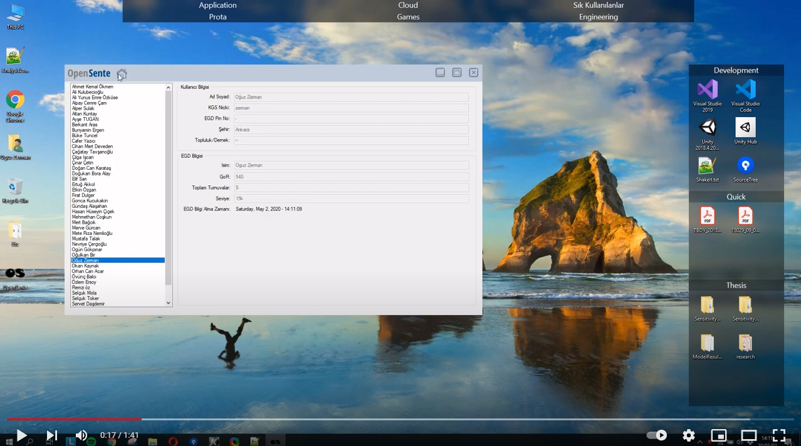

## `About`
`OpenSente` aims to ease following the fixture of the Go (Baduk) League coordinated by Turkish Go
Players’ Association. Custom user interfaces are prepared for the application. Player information is
taken from European Go Database by using API.

## `Demo`
Click on the below image to watch the demo.

